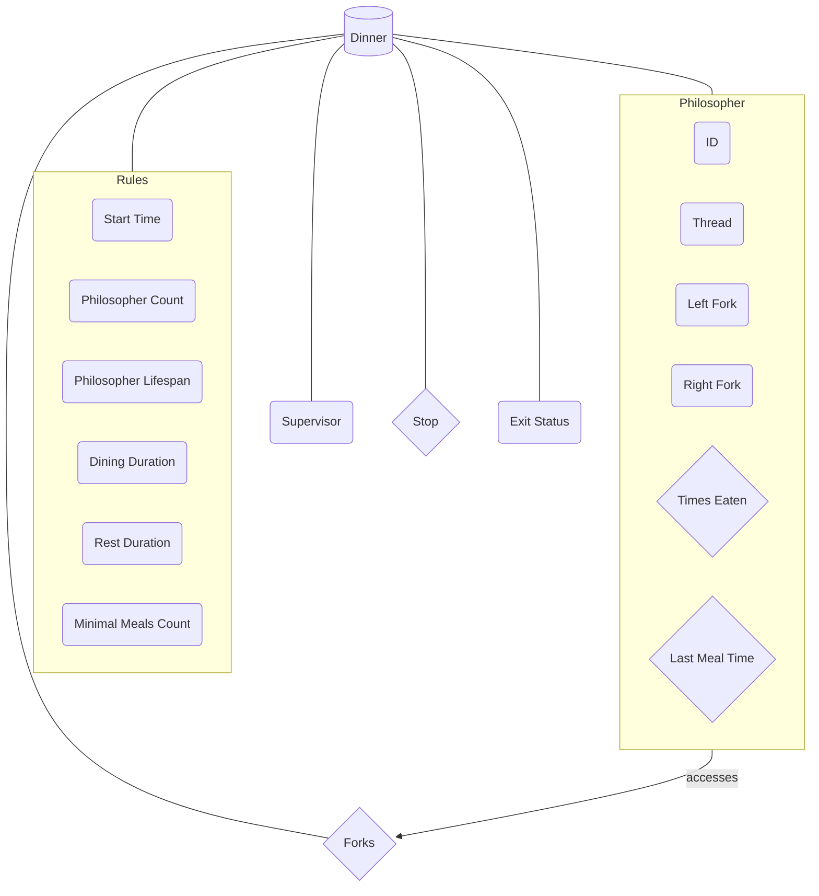

<h1 align="center">
	philosophers
</h1>

  

## Summary
> <i>Philosophers is a 42 school project designed around Edsger Dijkstra's famous dining philosophers problem. For this project, we must learn about concurrent</i>
> <i>programming. For the project's mandatory part, we must find a solution to the problem using only threads and mutexes. For the bonus part, we must create a second</i>
> <i>program that uses processes and semaphores.</i>

## The Diner Structure

